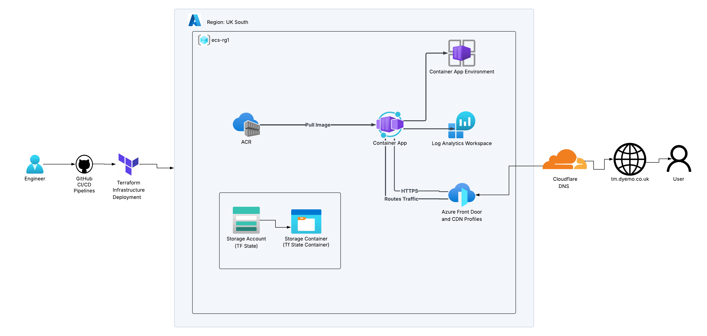

# TaskHub
TaskHub is a cloud-native task management web application built with Python Flask, containerised with Docker, and deployed on Microsoft Azure using modern DevOps practices.
The application allows users to create, manage, and track tasks with priority levels, categories, due dates, and completion status — all served securely over HTTPS via a custom domain.

### Project Goals

- Containerise Task Manager app
- Push it securely to Azure Container Registry (ACR)
- Provision infrastructure as code using Terraform
- Enable end-to-end CI/CD using GitHub Actions
- Serve the app publicly via custom HTTPS domain using Azure Front Door, with DNS resolution managed by Cloudflare

## Architecture Diagram



## TaskHub Demo


## Tech Stack

| Category | Technology |
|---|---|
| Application | Python Flask |
| Containerisation | Docker |
| Cloud Provider | Microsoft Azure |
| Infrastructure as Code | Terraform |
| CI/CD | GitHub Actions |
| Container Registry | Azure Container Registry (ACR) |
| Hosting | Azure Container Apps |
| DNS & CDN | Azure Front Door + Cloudflare |

## Architecture
The project follows a fully automated cloud deployment pipeline:

Code is pushed to GitHub, triggering GitHub Actions pipelines
The Docker image is built, tested, and pushed to ACR
Terraform provisions and manages all Azure infrastructure
Azure Front Door routes HTTPS traffic to the Container App
Cloudflare handles DNS resolution for the custom domain

## Project Structure

```
taskhub-azure-project/
├── .github/
│   └── workflows/
│       ├── push-docker-image.yml     # CI: Build and push Docker image to ACR
│       ├── terraform-plan.yml        # CI: Terraform plan to preview changes
│       ├── terraform-apply.yml       # CD: Terraform apply to deploy infra
│       └── terraform-destroy.yml     # CD: Terraform destroy to tear down infra
│
├── app/                              # Task manager app
│   ├── static/
│   │   ├── script.js
│   │   └── style.css
│   ├── templates/
│   │   └── index.html
│   ├── app.py
│   └── requirements.txt
│
├── images/                           
│
├── terraform/
│   ├── modules/                      # Terraform modules for reusable infra
│   │   ├── acr/                      # Azure Container Registry module
│   │   ├── container-app/            # Azure Container App module
│   │   └── frontdoor/                # Azure Front Door module
│   ├── state-storage/                # Remote backend state storage config
│   ├── .terraform.lock.hcl
│   ├── main.tf
│   ├── providers.tf
│   └── variables.tf
│
├── .gitignore
├── Dockerfile
└── README.md
```

## Workflow

### 1. Containerize the App and Push to ACR

- Built a Docker image from the Python Flask app
- Created Azure Container Registry (ACR) using Terraform
- Tagged and pushed the image to ACR

### 2. CI/CD Pipelines

**Docker Pipeline** — triggers on push to main
- Builds and tests the Docker image
- Pushes the image to ACR

**Terraform Plan** — triggers on pull request to main
- Runs `terraform plan` to preview infrastructure changes
- Runs tfsec security scan on Terraform code

**Terraform Apply** — triggers on push to main
- Runs `terraform apply` to deploy infrastructure changes to Azure

**Terraform Destroy** — manually triggered
- Runs `terraform destroy` to tear down all Azure infrastructure

### 3. Terraform deployment

Terraform is used to provision and manage all Azure infrastructure as code. 
Resources are organised into reusable modules, making the configuration clean and maintainable. 
The remote state is stored in an Azure Storage Account so both local and CI/CD pipeline deployments share the same state, preventing conflicts.

### 4. Expose Application via HTTPS

The application is exposed publicly using **Azure Front Door** provisioned via Terraform. Front Door handles HTTPS termination, routes traffic to the Container App, and serves the app via a custom domain.

**Custom Domain:** `https://tm.dyemo.co.uk`  
**DNS:** Managed by Cloudflare with a CNAME record pointing to the Front Door endpoint  
**SSL Certificate:** Automatically issued and managed by Azure Front Door

### 5. Custom Domain

The app is accessible via a custom domain `tm.dyemo.co.uk` configured through Cloudflare and Azure Front Door.

**Cloudflare DNS configuration:**
- A `CNAME` record pointing `tm` to the Front Door endpoint
- Proxy status set to **DNS only** — required for Front Door SSL certificate validation

## GitHub Secrets

GitHub secrets are referenced within CI/CD workflows to authenticate with external services such as Azure by injecting credentials (e.g., client ID, tenant ID, and client secret) into GitHub Actions workflows as environment variables, enabling secure login and deployment without exposing sensitive information in the codebase.

## GitHub Actions (CI/CD)

### Push Docker Image to ACR


### Terraform Plan


### Terraform Apply


### Terraform Destroy


## Azure Container app and Front Door

### Azure Container Apps Overview


### Azure Front Door Route and Dns Configuration


### Endpoint Overview


## Website Link: https://tm.dyemo.co.uk/


